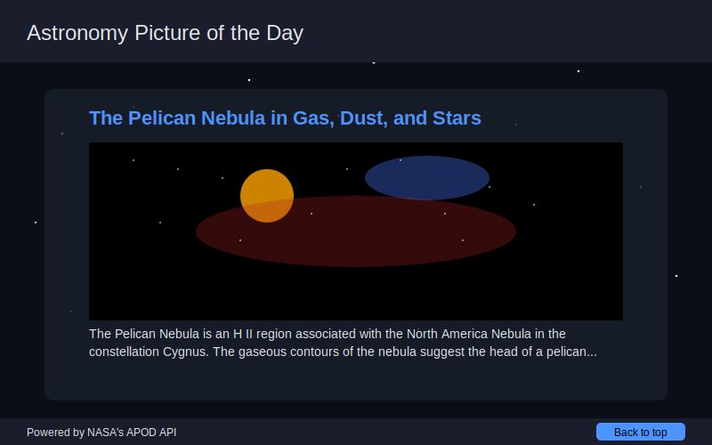
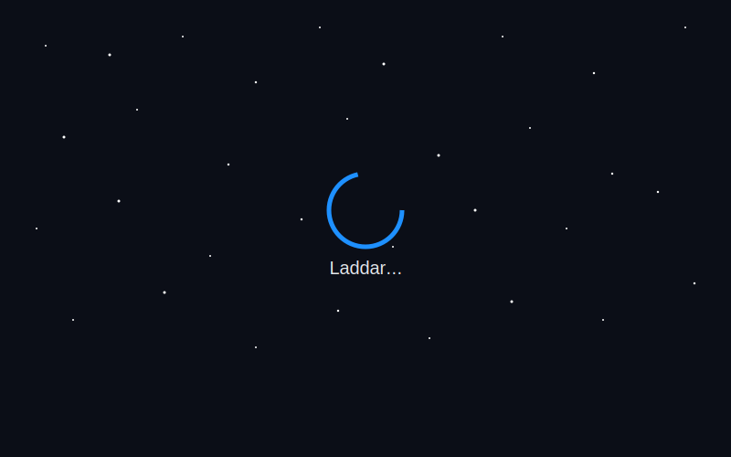

# Daily Constellation

En modern webbapplikation som visar NASA:s Astronomy Picture of the Day (APOD) med möjlighet att bläddra historiskt, markera favoriter och dela på sociala medier.

## Funktioner

- **Dagens astronomiska bild**: Se dagens bild från NASA's APOD API
- **Historiskt galleri**: Utforska bilder från specifika datum eller datumintervall
- **Favoritmarkering**: Spara dina favoritbilder för enkel åtkomst senare
- **Delningsfunktion**: Dela dagens bild på sociala medier eller kopiera länk
- **Responsiv design**: En vacker upplevelse på alla enheter
- **Tema-stöd**: Växla mellan mörkt, ljust och kosmiskt tema

## Teknologier

- **Frontend**: React, TypeScript, TailwindCSS
- **Backend**: Node.js, Express
- **API**: NASA APOD API

## Kom igång

### Förutsättningar

- Node.js (version 14.x eller högre)
- npm eller yarn
- En API-nyckel från NASA (se instruktioner nedan)

### Installation

1. Klona detta repository:
```bash
git clone https://github.com/ditt-användarnamn/daily-constellation.git
cd daily-constellation
```

2. Installera beroenden för både backend och frontend:
```bash
npm install
cd frontend
npm install
cd ..
```

3. Skapa en `.env`-fil i backend-mappen:
```bash
cd backend
touch .env
```

4. Lägg till följande i `.env`-filen:
```
NASA_API_KEY=DEMO_KEY
PORT=4001
```

## NASA API-nyckel

Applikationen använder NASA:s APOD API. Du kan använda "DEMO_KEY" men den har begränsningar:
- Maximalt 30 anrop per IP-adress per timme
- Maximalt 50 anrop per IP-adress per dag

För att skaffa din egen API-nyckel utan dessa begränsningar:

1. Besök [NASA API Portal](https://api.nasa.gov/)
2. Fyll i formuläret
3. Du får en API-nyckel skickad till din e-post
4. Uppdatera `.env`-filen med din nya nyckel:
   ```
   NASA_API_KEY=din_api_nyckel_här
   ```

### Starta applikationen

För att starta både frontend och backend samtidigt:

```bash
npm run dev
```

Detta kommer att starta:
- Backend på http://localhost:4001
- Frontend på http://localhost:5173

Du kan också starta dem separat:

```bash
# Endast backend
npm run start:backend

# Endast frontend
npm run start:frontend
```

## Användning

När applikationen är igång kan du:

1. Bläddra mellan olika vyer via navigationsfältet
2. Se dagens astronomiska bild på startsidan
3. Markera bilder som favoriter genom att klicka på hjärtikonen
4. Dela bilder genom att klicka på delningsikonen
5. Utforska historiska bilder genom att besöka gallerisidan och välja datumintervall

## Licens

Detta projekt är licensierat under MIT-licensen.

## 📋 Projektöversikt

Daily Constellation är en fullstack-applikation som hämtar och visar den senaste astronomiska bilden från NASA:s APOD API. Applikationen ger användarna möjlighet att utforska universum genom vackra bilder och informativa beskrivningar som uppdateras dagligen.

### ✨ Funktioner:

- Visar dagens astronomiska bild eller video från NASA
- Responsiv design som fungerar på alla enheter
- Eleganta laddningsanimationer
- Visar detaljerade beskrivningar från NASA:s astronomer
- Modern och kosmiskt inspirerad användargränssnitt

## 🛠️ Teknikstack

### Frontend
- React 18
- TypeScript
- Vite
- Tailwind CSS
- Axios för API-anrop

### Backend
- Node.js
- Express
- TypeScript
- Axios för proxying av NASA API-anrop

## 📋 Skärmdumpar


*Huvudvyn visar dagens astronomiska bild/video från NASA*


*Snygg laddningsanimation medan data hämtas*

## 🔄 Arbetsflöde

Applikationen fungerar enligt följande:
1. Frontend skickar en förfrågan till backend-API:et
2. Backend hämtar data från NASA:s APOD API med din API-nyckel
3. Datan skickas tillbaka till frontend och visas för användaren
4. Bilden/videon och beskrivningen uppdateras varje dag när NASA publicerar nytt innehåll

## 🚧 Felsökning

Om du stöter på problem:

1. Kontrollera att både frontend och backend körs
2. Verifiera att din NASA API-nyckel är korrekt i .env-filen
3. Se till att port 3000 är tillgänglig för backend-servern
4. Kontrollera att ts-node är installerat: `npm install -D ts-node typescript`
5. Om du ser "Failed to fetch astronomy picture", kan det bero på att backend-servern inte svarar

## 📄 Licens

Detta projekt är licensierat under MIT-licensen - se [LICENSE](LICENSE) filen för mer information.

## 👨‍💻 Bidrag

Bidrag, problem och förfrågningar välkomnas! Tveka inte att checka ut [issues page](https://github.com/yourusername/Daily-Constellation/issues).

---

Skapat med ❤️ av [Ditt Namn] 